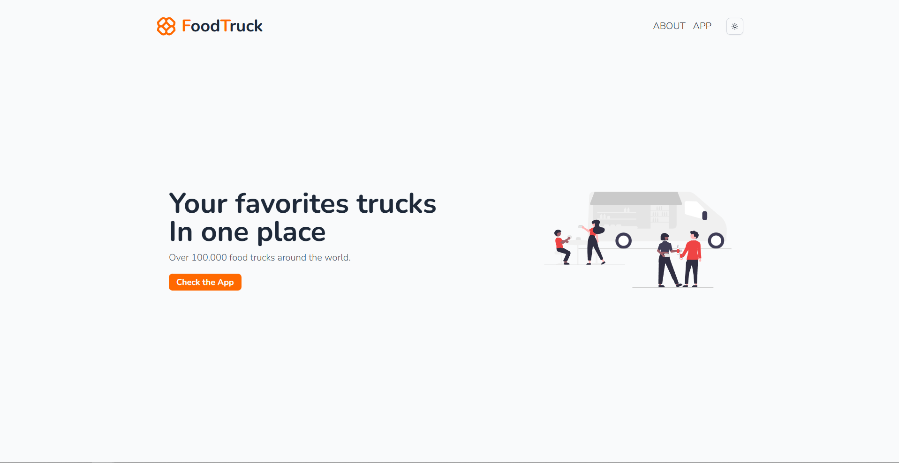
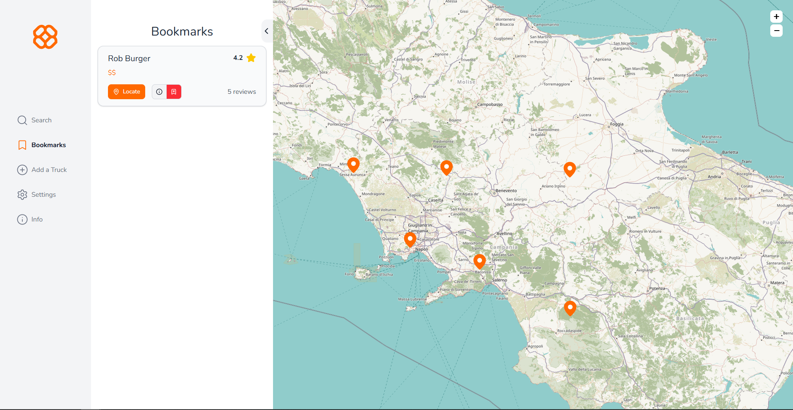
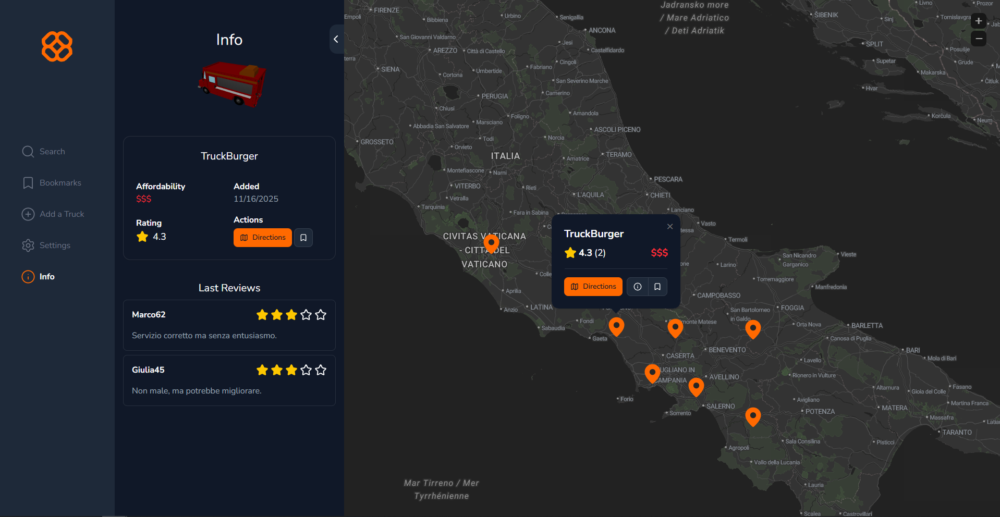
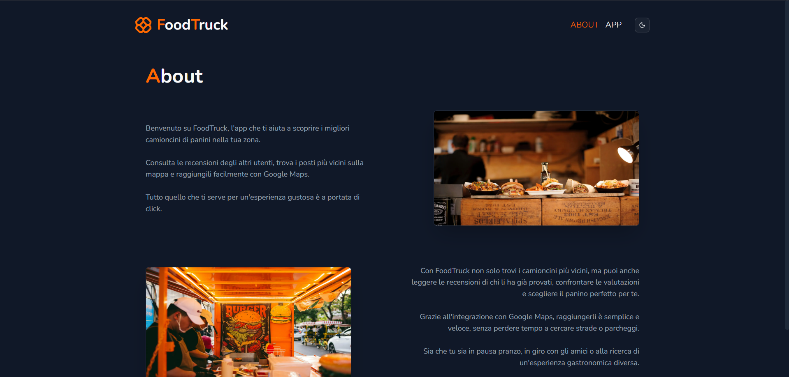
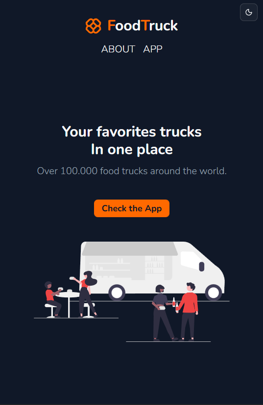
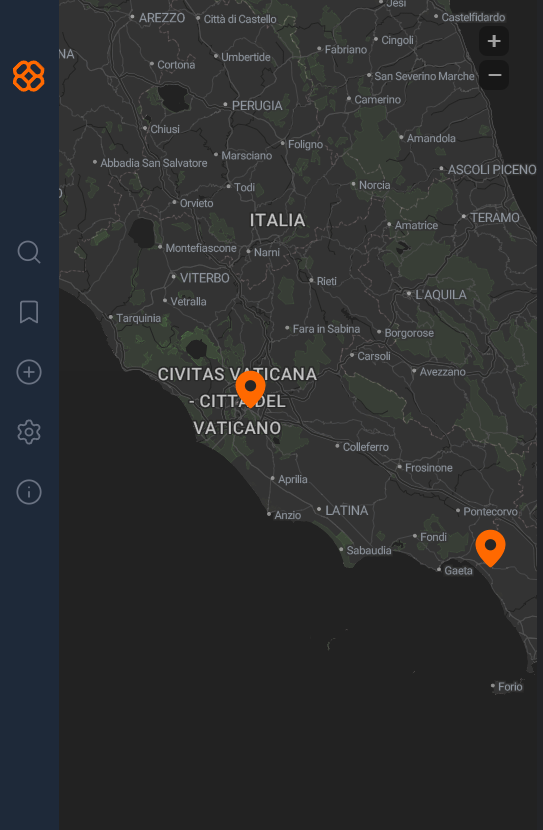
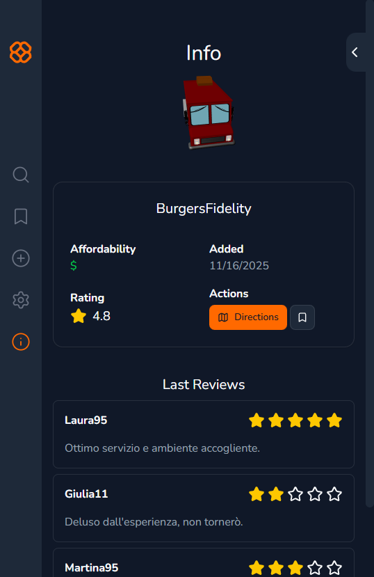

# FoodTruck

Web application for tracking food trucks around the world. You can add new trucks, view their location and details through Google Maps integration, and read other user reviews. The interface is fully responsive and includes a native dark mode for a consistent experience across all devices. Designed to be fast, simple, and easy to use.

## Images




### Dark Mode




### Responsive Design





## Tech Stack

- React 19.2
- Next.js 16.0.1
- TailwindCSS 4.1
- TypeScript
- Supabase
- lucide-react
- react-hot-toast
- shadcn/ui
- react-hook-form
- leaflet
- react-leaflet
- three.js

## Installation

1. Clone the repository:

```bash
git clone https://github.com/crstelli/food-truck
```

2. Navigate into project folder

```bash
cd food-truck
```

3. Install dependencies

```bash
npm install
```

4. Disable DevMode in `lib/constants.ts`

5. Start the development server:

```bash
npm run dev
```

6. Open your browser and navigate to:

```bash
http://localhost:3000
```

## Environment Variables

You need to configure environment variables for the app to work correctly.
Create a `.env.local` file in the project root and add:

```bash
NEXT_PUBLIC_SUPABASE_URL = Your Supabase Project URL
NEXT_PUBLIC_SUPABASE_KEY = Your Supabase Key
```

## Features

- Geolocation with a responsive map
- Search trucks with a search bar
- Save favorite trucks in bookmarks
- Add new trucks (disabled when DevMode is enabled)
- Dark and Light themes
- Truck information and reviews of trucks
- Open truck location in Google Maps
- Locate a truck on the map
- Affordability rating
- Responsive Design

## Future Improvements

- Authentication
- Adding reviews to trucks
- Truck owning and page personalization
- Pricing and menus

## Author

Giuseppe - [LinkedIn](https://linkedin.com/in/crescitelli) - [Portfolio](https://crescitelli.dev)

## License

This project is licensed under the [MIT License](LICENSE).
